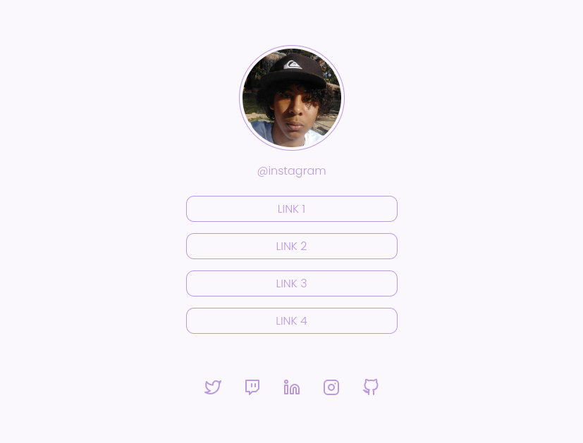

# Social Tree

> Desafio da Rocketseat

pré-visualização da minha versão do projeto

[🔗Clique aqui para acessar](https://atilacsilva.github.io/Social-Tree)

## 🔥Sobre o desafio!

Nesse Challeng, você deve construir uma página com uma lista de links. além de uma imagem de perfil e redes sociais na area do footer.

## 🛠️ Tecnologias!

- HTML5
- CSS
- JavaScript

### ✍️ O que Aprendi!!

A usar melhor a api do Github e incrementar animações em certas partes da aplication. Além de revisar os fundamentos da construção de qualquer basic aplication.
